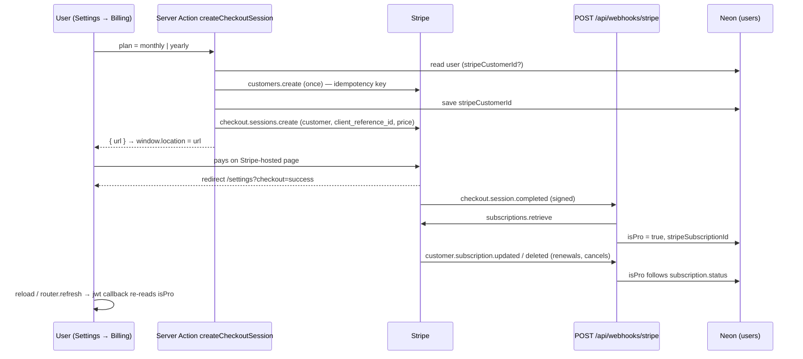

# Stripe Subscription Integration Plan

> Implementation plan for DevStash Pro — **$8/month or $72/year** — using Stripe
> Checkout (hosted), the Stripe Billing Portal, and a webhook that keeps
> `User.isPro` in sync. Grounded in the code as it exists today (NextAuth v5 split
> config, `{ success, data, error }` server actions, `src/lib/db/*` queries,
> Upstash rate limiting). Documentation only — nothing here is built yet.

Source prompt: [`context/research/stripe-integration-research.md`](../context/research/stripe-integration-research.md)

---

## 1. Summary of decisions

| Concern | Decision |
| --- | --- |
| Checkout | Stripe-hosted Checkout, `mode: "subscription"`, started by a **Server Action** that returns the Checkout URL (client navigates). No Stripe.js / publishable key needed. |
| Manage / cancel / change plan / invoices | Stripe **Billing Portal**, started by a Server Action. We build none of that UI. |
| Source of truth | The **webhook** writes `User.isPro`, `stripeCustomerId`, `stripeSubscriptionId`. The browser is never trusted (`success_url` is display-only). |
| Session sync | Per your note: the `jwt` callback re-reads `isPro` from the DB on every session validation. Lives in **`src/auth.ts` only** (Prisma can't run in the edge-safe `auth.config.ts`). |
| Plan state in the DB | **No migration.** `isPro`, `stripeCustomerId` (unique), `stripeSubscriptionId` (unique) already exist from the `init` migration. |
| Limits / gating | Pure rules in `src/lib/billing/plans.ts` (unit-tested), enforced in the **server actions + `/api/upload`**, mirrored in the UI for friendly prompts. |
| Existing data on downgrade | Never deleted or locked — a downgraded user just can't *create* past the free limits. |
| Dev-time escape hatch | `PRO_GATING_ENABLED="false"` (same pattern as `EMAIL_VERIFICATION_ENABLED`) because `project-overview.md` says gating is enabled "before launch". |

---

## 2. Current state analysis

### 2.1 User model and Stripe fields

`prisma/schema.prisma` (`User`, mapped to `users`):

```prisma
isPro                Boolean  @default(false)
stripeCustomerId     String?  @unique
stripeSubscriptionId String?  @unique
```

- All three columns exist in the `init` migration
  (`prisma/migrations/20260821184403_init/migration.sql`, incl. both unique
  indexes). **Nothing reads or writes them yet** — the only references are the
  seed (`isPro: false` for the demo user) and `scripts/test-db.ts`, which just
  prints `isPro`.
- The Prisma client is generated to `src/generated/prisma` and imported as
  `@/generated/prisma/client`; the app client is `@/lib/prisma`.
- `src/lib/mock-data.ts` still carries a stale `isPro` on its mock user — unused by
  real pages, leave it alone.

### 2.2 NextAuth configuration and session handling

| File | Role |
| --- | --- |
| `src/auth.config.ts` | **Edge-safe** config: GitHub provider, a `() => null` Credentials placeholder, `pages.signIn`, and a `session` callback that copies `token.sub` → `session.user.id`. No adapter, no Prisma. |
| `src/auth.ts` | Full config: `PrismaAdapter`, `session: { strategy: "jwt" }`, `...authConfig`, real Credentials `authorize` (bcrypt + rate limiting + email-verification check). Exports `handlers, auth, signIn, signOut`. |
| `src/proxy.ts` | Builds its **own** `NextAuth(authConfig)` (adapter-free), `matcher: ["/dashboard/:path*"]`, redirects signed-out users to `/sign-in?callbackUrl=…`. |
| `src/types/next-auth.d.ts` | Augments `Session["user"]` with `id: string`. **No `isPro`, and no `next-auth/jwt` augmentation.** |

Consequences for this feature:

1. The `jwt` callback needs Prisma, so it must be added in `src/auth.ts`, **not**
   `auth.config.ts`. The proxy's edge instance never runs it — it only decodes and
   re-issues whatever `isPro` is already in the cookie, which is fine because the
   proxy makes no plan decisions.
2. `auth.ts` does `...authConfig` and then would add its own `callbacks`. A plain
   `callbacks: { jwt }` **replaces** the whole object and silently drops the
   existing `session` callback (`session.user.id` would become `undefined` and every
   `requireUserId()` would fail). It must be `callbacks: { ...authConfig.callbacks, jwt }`.
3. `session` callback lives in `auth.config.ts`, so `session.user.isPro` is set
   there (plain property copy from the token — edge-safe).
4. The Prisma adapter is only used for GitHub OAuth account linking; JWT
   sessions mean there are no `sessions` rows to update.

### 2.3 How user data is reached in actions and components

- **Server actions** (`src/actions/items.ts`, `collections.ts`, `editor-preferences.ts`):
  `requireUserId(verb)` from `src/actions/shared.ts` calls `auth()` and returns
  `{ userId }` or `{ error }`. Returns follow `ActionResult<T>`
  (`{ success: true, data } | { success: false, error }`), with `zodMessage()` and a
  `GENERIC_ERROR` constant, all defined in the plain (non-`"use server"`)
  `src/actions/shared.ts`.
- **DB layer** (`src/lib/db/*`): every query starts with
  `getCurrentUserId()` (`src/lib/db/current-user.ts`, wrapped in `React.cache`) and
  scopes by `userId`. `src/lib/db/user.ts` has `getProfileUser()` (selects id, name,
  email, image, createdAt, and reduces `password` to `hasPassword`).
- **App shell**: `src/app/(app)/layout.tsx` is `force-dynamic`, calls `auth()` and
  passes `user` to the sidebar; it already fetches `itemTypes` **with per-type
  counts** (`getItemTypesWithCounts()`) and **every** collection
  (`getRecentCollections()` with no limit) — so total item count and collection
  count are available there with **zero extra queries**.
- Client components get server data via props or small context providers
  (`item-drawer-provider`, `command-palette-provider`, `editor-preferences-provider`).

### 2.4 Existing subscription / payment code

None. What exists is Pro-*shaped* scaffolding only:

- `PRO_ITEM_TYPES = new Set(["file","image"])` + `isProItemType()` in
  `src/lib/constants/item-types.ts` (unit-tested) — used only by the sidebar to
  render the **PRO** badge / "· PRO" tooltip suffix.
- `.env.example` already has an uncommitted `# Stripe` block with
  `STRIPE_SECRET_KEY`, `STRIPE_PUBLISHABLE_KEY`, `STRIPE_WEBHOOK_SECRET`,
  `STRIPE_PRICE_ID_MONTHLY`, `STRIPE_PRICE_ID_YEARLY` (no trailing newline).
- The homepage `PricingSection` shows $8/mo ↔ $72/yr; its "Upgrade to Pro" button
  goes to `/register`. The `stripe` npm package is **not installed**.

---

## 3. Feature gating analysis

### 3.1 Limits from the spec

| Limit | Free | Pro |
| --- | --- | --- |
| Items (total, all types) | **50** | Unlimited |
| Collections | **3** | Unlimited |
| File & Image items | ❌ | ✅ |
| Custom types | ❌ (not built) | 🔜 |
| AI features (tag, explain, optimizer) | ❌ (not built) | ✅ |
| Data export (JSON/ZIP) | ❌ (not built) | ✅ |

Nothing is enforced today: `createItem` and `createCollection` (in `src/lib/db/`)
write unconditionally, and `POST /api/upload` only checks for a session.

### 3.2 Where counts are (and should be) checked

| Path | Today | Change |
| --- | --- | --- |
| `createItem` action → `src/lib/db/items.ts` `createItem` | no check | Check **in the action** before the query (so a message can be returned): file/image ⇒ Pro; otherwise `count(items where userId) < 50`. |
| `createCollection` action → `src/lib/db/collections.ts` | no check | Check in the action: `count(collections where userId) < 3`. |
| `POST /api/upload` | session only | Return `403 { error, code: "UPGRADE_REQUIRED" }` for non-Pro **before** parsing the multipart body (avoids buffering a 10 MB file just to reject it, and avoids R2 writes). |
| `GET /api/items/[id]/download` | ownership-scoped | **No gate** — a downgraded user must still be able to download their own files. |
| `updateItem`, `deleteItem`, toggles | — | No gate. (Item type can't change on update, so no bypass.) |
| Counts for the UI | `getItemStats()` / `getCollectionStats()` exist | Reuse. In the `(app)` layout derive them from data already fetched. |

The count-then-insert check is not atomic, so two concurrent creates can overshoot
by one. That is acceptable for a soft product limit; note it, don't build locking.

### 3.3 Pro-only features not built yet

AI tagging/explain/optimizer, export, and custom types don't exist. The plan's
`hasProAccess()` + `getCurrentUserIsPro()` helpers are the hook they will use; no
other work for them here.

### 3.4 Settings page structure

`src/app/(app)/settings/page.tsx` — `force-dynamic` server component, self-guarded
with `auth()` → redirect, then `getProfileUser()`. Layout: back link, `<h1>`, and
two `<section>`s ("Editor", "Account"), each a `Card > CardContent` wrapping one
client component (`EditorPreferencesSettings`, `AccountActions`). A **"Billing"**
section slots in above "Account" using the identical pattern.

---

## 4. API and webhook patterns already in the repo

- **API routes** (`src/app/api/**/route.ts`): named `GET`/`POST` exports, JSON via
  `NextResponse.json`, `auth()` → `401` at the top, try/catch → generic `500`, and
  `console.error` with context. Auth routes are **outside** the proxy matcher and
  guard themselves. Dynamic params are typed
  `{ params: Promise<{ id: string }> }` (`api/items/[id]/route.ts`).
- **Where a webhook lives**: `project-overview.md` reserves
  `src/app/api/webhooks/stripe/`. `coding-standards.md` explicitly lists webhooks
  as a reason to use an API route rather than a Server Action.
- **Raw body**: the Next 16 docs (`route.md` → *Webhooks*) show reading the payload
  with `await request.text()` — no body-parser config needed in the App Router.
  Route handlers run on the Node runtime by default, which the Stripe SDK needs.
- **Proxy**: matcher is only `/dashboard/:path*`, so `/api/webhooks/stripe` is never
  intercepted. Do **not** widen the matcher to include it.
- **Server action error handling**: `requireUserId` → validate → scoped query in
  `try/catch` → `{ success:false, error: GENERIC_ERROR }`; UI shows the message
  inline via `<FormError>` and via `sonner` toast.
- **Env var patterns**: lazily-created SDK clients that throw a clear error when
  unset (`src/lib/email/resend.ts`, `src/lib/r2.ts` with `isR2Configured()`);
  boolean master switches read as `process.env.X !== "false"`
  (`isEmailVerificationEnabled()`); `APP_URL` for absolute links
  (`getAppBaseUrl(request)` in `src/lib/auth/verification.ts` — needs a `Request`,
  so it can't be reused from a Server Action as-is); every new var documented in
  `.env.example`.
- **Rate limiting**: `src/lib/rate-limit.ts` — named limiters in `RATE_LIMITS`,
  fail-open, `checkRateLimit(name, id)` returns `{ success, reset }`.

---

## 5. Architecture



Key properties:

- **The Stripe customer is created and saved *before* Checkout starts.** This means
  later `customer.subscription.*` events can always be matched to a user by
  `stripeCustomerId` — even if one arrives before `checkout.session.completed`
  (Stripe does not guarantee event ordering).
- The webhook handler is **idempotent by construction**: every branch writes the
  *current* state derived from the subscription object, so Stripe retries and manual
  "resend event" are harmless. No processed-events table is needed.
- `isPro` is derived from **subscription status**, not from which event fired.

---

## 6. Files to create

### 6.1 `src/lib/stripe.ts` — lazy client

Same shape as `src/lib/r2.ts` / `src/lib/email/resend.ts`.

```ts
import Stripe from "stripe";

/**
 * Lazily-created Stripe client, cached on `globalThis` (same pattern as
 * `src/lib/prisma.ts`) so `next dev` HMR doesn't create a new client per reload.
 * Only import this from server code — it uses the secret key.
 */

export function isStripeConfigured(): boolean {
    return Boolean(
        process.env.STRIPE_SECRET_KEY &&
            process.env.STRIPE_PRICE_ID_MONTHLY &&
            process.env.STRIPE_PRICE_ID_YEARLY,
    );
}

const globalForStripe = globalThis as unknown as { stripeClient?: Stripe };

export function getStripe(): Stripe {
    const key = process.env.STRIPE_SECRET_KEY;
    if (!key) {
        throw new Error("STRIPE_SECRET_KEY is not set.");
    }
    if (!globalForStripe.stripeClient) {
        globalForStripe.stripeClient = new Stripe(key);
    }
    return globalForStripe.stripeClient;
}
```

> No `apiVersion` is passed, so the SDK's pinned default is used and upgrading the
> package is the only thing that moves the API version.

### 6.2 `src/lib/billing/plans.ts` — pure rules (unit-tested)

No Prisma, no `auth`, no Stripe imports — same rule that put `contentFieldsForType`
in `validation/item.ts`, because anything importing `src/lib/db/**` pulls in
`src/lib/prisma.ts`, which throws at import time without `DATABASE_URL` under Vitest.

```ts
import { isProItemType } from "@/lib/constants/item-types";

export const FREE_ITEM_LIMIT = 50;
export const FREE_COLLECTION_LIMIT = 3;

export const BILLING_PLANS = ["monthly", "yearly"] as const;
export type BillingPlan = (typeof BILLING_PLANS)[number];

export function isBillingPlan(value: unknown): value is BillingPlan {
    return BILLING_PLANS.includes(value as BillingPlan);
}

export function priceIdForPlan(plan: BillingPlan): string | undefined {
    return plan === "monthly"
        ? process.env.STRIPE_PRICE_ID_MONTHLY
        : process.env.STRIPE_PRICE_ID_YEARLY;
}

/**
 * Subscription statuses that keep Pro access on. `past_due` is included as a
 * grace period while Stripe retries the card (Smart Retries); access ends when
 * the subscription becomes `canceled` / `unpaid` / `incomplete_expired`.
 */
const PRO_SUBSCRIPTION_STATUSES = new Set(["active", "trialing", "past_due"]);

export function isProSubscriptionStatus(status: string): boolean {
    return PRO_SUBSCRIPTION_STATUSES.has(status);
}

/** Statuses after which the subscription can never come back. */
export function isTerminalSubscriptionStatus(status: string): boolean {
    return status === "canceled" || status === "incomplete_expired";
}

/**
 * Master switch mirroring `EMAIL_VERIFICATION_ENABLED`: set
 * `PRO_GATING_ENABLED="false"` to give everyone Pro access during development.
 * Unset (including in production) keeps gating ON.
 */
export function hasProAccess(isPro: boolean): boolean {
    return isPro || process.env.PRO_GATING_ENABLED === "false";
}

export type GateResult = { allowed: true } | { allowed: false; error: string };

export const PRO_TYPE_ERROR = "File and image uploads are a Pro feature. Upgrade to add them.";
export const ITEM_LIMIT_ERROR = `The Free plan is limited to ${FREE_ITEM_LIMIT} items. Upgrade to Pro for unlimited items.`;
export const COLLECTION_LIMIT_ERROR = `The Free plan is limited to ${FREE_COLLECTION_LIMIT} collections. Upgrade to Pro for unlimited collections.`;

export function canCreateItem(args: {
    hasPro: boolean;
    itemCount: number;
    itemType: string;
}): GateResult {
    if (args.hasPro) return { allowed: true };
    if (isProItemType(args.itemType)) return { allowed: false, error: PRO_TYPE_ERROR };
    if (args.itemCount >= FREE_ITEM_LIMIT) return { allowed: false, error: ITEM_LIMIT_ERROR };
    return { allowed: true };
}

export function canCreateCollection(args: {
    hasPro: boolean;
    collectionCount: number;
}): GateResult {
    if (args.hasPro || args.collectionCount < FREE_COLLECTION_LIMIT) return { allowed: true };
    return { allowed: false, error: COLLECTION_LIMIT_ERROR };
}
```

### 6.3 `src/lib/billing/limits.ts` — DB-backed gate helpers

```ts
import { prisma } from "@/lib/prisma";
import { getCurrentUserId, getCurrentUserIsPro } from "@/lib/db/current-user";
import {
    canCreateCollection,
    canCreateItem,
    hasProAccess,
} from "@/lib/billing/plans";

/** Returns an error message when the current user may not create this item, else `null`. */
export async function getItemCreationBlock(itemType: string): Promise<string | null> {
    const userId = await getCurrentUserId();
    if (!userId) return null; // the action's requireUserId() already rejected this
    const hasPro = hasProAccess(await getCurrentUserIsPro());
    if (hasPro) return null; // Pro: skip the count query
    const itemCount = await prisma.item.count({ where: { userId } });
    const result = canCreateItem({ hasPro, itemCount, itemType });
    return result.allowed ? null : result.error;
}

export async function getCollectionCreationBlock(): Promise<string | null> {
    const userId = await getCurrentUserId();
    if (!userId) return null;
    const hasPro = hasProAccess(await getCurrentUserIsPro());
    if (hasPro) return null;
    const collectionCount = await prisma.collection.count({ where: { userId } });
    const result = canCreateCollection({ hasPro, collectionCount });
    return result.allowed ? null : result.error;
}
```

### 6.4 `src/lib/billing/subscription-sync.ts` — the single write path

Everything that changes plan state goes through `applySubscription`. The pure
decision (`isProSubscriptionStatus`, `isTerminalSubscriptionStatus`) is in
`plans.ts` so it's testable; this file is the Prisma glue.

```ts
import type Stripe from "stripe";

import { prisma } from "@/lib/prisma";
import {
    isProSubscriptionStatus,
    isTerminalSubscriptionStatus,
} from "@/lib/billing/plans";

/** `customer` / `subscription` are `string | object | null` depending on expansion. */
export function stripeId(ref: string | { id: string } | null): string | null {
    if (!ref) return null;
    return typeof ref === "string" ? ref : ref.id;
}

/**
 * Writes the user's plan state from a Stripe subscription. Called by every
 * webhook branch, so it must be idempotent: it stores the *current* state, never
 * a delta.
 *
 * `knownUserId` comes from the Checkout session's `client_reference_id`; the
 * subscription events have no such field, so they resolve the user by
 * `stripeCustomerId` (saved before Checkout starts) with `metadata.userId` as a
 * fallback.
 */
export async function applySubscription(
    subscription: Stripe.Subscription,
    knownUserId?: string | null,
): Promise<void> {
    const customerId = stripeId(subscription.customer);
    if (!customerId) return;

    const userId = knownUserId ?? subscription.metadata?.userId ?? null;
    const user = userId
        ? await prisma.user.findUnique({ where: { id: userId } })
        : await prisma.user.findUnique({ where: { stripeCustomerId: customerId } });

    if (!user) {
        console.warn(`[stripe] No user for customer ${customerId} (subscription ${subscription.id}).`);
        return;
    }

    const isPro = isProSubscriptionStatus(subscription.status);

    // Out-of-order guard: a *dead* older subscription must not revoke access
    // granted by a newer one (user cancelled, then re-subscribed).
    if (
        user.stripeSubscriptionId &&
        user.stripeSubscriptionId !== subscription.id &&
        !isPro
    ) {
        return;
    }

    await prisma.user.update({
        where: { id: user.id },
        data: {
            isPro,
            stripeCustomerId: customerId,
            stripeSubscriptionId: isTerminalSubscriptionStatus(subscription.status)
                ? null
                : subscription.id,
        },
    });
}
```

- The `stripeCustomerId` is kept after a cancel so the Billing Portal (invoice
  history) and a future re-subscribe reuse the same Stripe customer.
- `stripeSubscriptionId` is nulled on terminal statuses because it's `@unique` and
  points at nothing useful.

### 6.5 `src/app/api/webhooks/stripe/route.ts`

```ts
import { NextResponse } from "next/server";
import type Stripe from "stripe";

import { getStripe, isStripeConfigured } from "@/lib/stripe";
import { applySubscription, stripeId } from "@/lib/billing/subscription-sync";

/**
 * POST /api/webhooks/stripe
 *
 * Stripe → DevStash. Signature-verified (that is the only auth — no session, no
 * rate limit). Must read the RAW body via `request.text()`: parsing it as JSON
 * first would change the bytes and break the signature. Returns 400 for a bad
 * signature (Stripe won't retry those usefully), 500 for our own failures so
 * Stripe retries, and 200 for everything handled or intentionally ignored.
 */
export async function POST(request: Request) {
    const secret = process.env.STRIPE_WEBHOOK_SECRET;
    if (!isStripeConfigured() || !secret) {
        return NextResponse.json({ error: "Billing is not configured." }, { status: 503 });
    }

    const signature = request.headers.get("stripe-signature");
    if (!signature) {
        return NextResponse.json({ error: "Missing signature." }, { status: 400 });
    }

    const stripe = getStripe();
    const body = await request.text();

    let event: Stripe.Event;
    try {
        event = stripe.webhooks.constructEvent(body, signature, secret);
    } catch (error) {
        console.error("Stripe webhook signature verification failed:", error);
        return NextResponse.json({ error: "Invalid signature." }, { status: 400 });
    }

    try {
        switch (event.type) {
            case "checkout.session.completed": {
                const session = event.data.object;
                if (session.mode !== "subscription") break;
                const subscriptionId = stripeId(session.subscription);
                if (!subscriptionId) break;
                const subscription = await stripe.subscriptions.retrieve(subscriptionId);
                await applySubscription(subscription, session.client_reference_id);
                break;
            }
            case "customer.subscription.created":
            case "customer.subscription.updated":
            case "customer.subscription.deleted":
                await applySubscription(event.data.object);
                break;
            default:
                break; // Subscribed-to-but-unused or future event types: acknowledge.
        }
    } catch (error) {
        console.error(`Failed to process Stripe event ${event.id} (${event.type}):`, error);
        return NextResponse.json({ error: "Webhook handler failed." }, { status: 500 });
    }

    return NextResponse.json({ received: true });
}
```

### 6.6 `src/lib/billing/checkout.ts` + `src/actions/billing.ts`

`src/lib/billing/checkout.ts` (Prisma + Stripe glue; not unit-tested, like the other
`db`/`r2` modules):

```ts
import { headers } from "next/headers";

import { prisma } from "@/lib/prisma";
import { getStripe } from "@/lib/stripe";
import { priceIdForPlan, type BillingPlan } from "@/lib/billing/plans";

/** `APP_URL` when set, otherwise the request origin (Server Actions have no `Request`). */
async function getBaseUrl(): Promise<string> {
    const configured = process.env.APP_URL?.replace(/\/+$/, "");
    if (configured) return configured;
    const origin = (await headers()).get("origin");
    if (!origin) throw new Error("Set APP_URL so Stripe can build return URLs.");
    return origin;
}

export async function createCheckoutUrl(userId: string, plan: BillingPlan): Promise<string> {
    const user = await prisma.user.findUnique({
        where: { id: userId },
        select: { email: true, name: true, isPro: true, stripeCustomerId: true },
    });
    if (!user) throw new Error("User not found.");

    const priceId = priceIdForPlan(plan);
    if (!priceId) throw new Error(`No Stripe price configured for the ${plan} plan.`);

    const stripe = getStripe();

    let customerId = user.stripeCustomerId;
    if (!customerId) {
        // Idempotency key: two rapid clicks (or two tabs) get the SAME customer back
        // instead of creating a duplicate that the unique column would then reject.
        const customer = await stripe.customers.create(
            { email: user.email, name: user.name ?? undefined, metadata: { userId } },
            { idempotencyKey: `devstash-customer-${userId}` },
        );
        customerId = customer.id;
        await prisma.user.update({ where: { id: userId }, data: { stripeCustomerId: customerId } });
    }

    const baseUrl = await getBaseUrl();
    const session = await stripe.checkout.sessions.create({
        mode: "subscription",
        customer: customerId,
        client_reference_id: userId,
        line_items: [{ price: priceId, quantity: 1 }],
        subscription_data: { metadata: { userId } },
        allow_promotion_codes: true,
        success_url: `${baseUrl}/settings?checkout=success`,
        cancel_url: `${baseUrl}/settings?checkout=canceled`,
    });

    if (!session.url) throw new Error("Stripe did not return a Checkout URL.");
    return session.url;
}

export async function createPortalUrl(userId: string): Promise<string | null> {
    const user = await prisma.user.findUnique({
        where: { id: userId },
        select: { stripeCustomerId: true },
    });
    if (!user?.stripeCustomerId) return null;

    const session = await getStripe().billingPortal.sessions.create({
        customer: user.stripeCustomerId,
        return_url: `${await getBaseUrl()}/settings`,
    });
    return session.url;
}
```

`src/actions/billing.ts` (third `"use server"` action file, same contract):

```ts
"use server";

import {
    GENERIC_ERROR,
    requireUserId,
    type ActionResult,
} from "@/actions/shared";
import { createCheckoutUrl, createPortalUrl } from "@/lib/billing/checkout";
import { isBillingPlan } from "@/lib/billing/plans";
import { checkRateLimit } from "@/lib/rate-limit";
import { isStripeConfigured } from "@/lib/stripe";
import { getCurrentUserIsPro } from "@/lib/db/current-user";

export async function createCheckoutSession(
    plan: unknown,
): Promise<ActionResult<{ url: string }>> {
    const user = await requireUserId("upgrade");
    if ("error" in user) return { success: false, error: user.error };

    if (!isBillingPlan(plan)) return { success: false, error: "Choose a monthly or yearly plan." };
    if (!isStripeConfigured()) return { success: false, error: "Billing is not available right now." };
    if (await getCurrentUserIsPro()) return { success: false, error: "You're already on Pro." };

    const limit = await checkRateLimit("billing", user.userId);
    if (!limit.success) return { success: false, error: "Too many attempts. Please try again shortly." };

    try {
        return { success: true, data: { url: await createCheckoutUrl(user.userId, plan) } };
    } catch (error) {
        console.error("Failed to create Checkout session:", error);
        return { success: false, error: GENERIC_ERROR };
    }
}

export async function createPortalSession(): Promise<ActionResult<{ url: string }>> {
    const user = await requireUserId("manage billing");
    if ("error" in user) return { success: false, error: user.error };
    if (!isStripeConfigured()) return { success: false, error: "Billing is not available right now." };

    const limit = await checkRateLimit("billing", user.userId);
    if (!limit.success) return { success: false, error: "Too many attempts. Please try again shortly." };

    try {
        const url = await createPortalUrl(user.userId);
        if (!url) return { success: false, error: "No billing account found yet." };
        return { success: true, data: { url } };
    } catch (error) {
        console.error("Failed to create portal session:", error);
        return { success: false, error: GENERIC_ERROR };
    }
}
```

Returning `{ url }` (rather than calling `redirect()` inside the action) keeps the
`ActionResult` contract and lets the client show a toast on failure. The client does
`window.location.assign(result.data.url)`.

### 6.7 `src/components/billing/plan-provider.tsx`

Small client context (same shape as `item-drawer-provider.tsx`) so the New Item /
New Collection dialogs and any future Pro-gated control can read the plan without
prop-drilling through `TopBar`.

```tsx
"use client";

import { createContext, useContext } from "react";

export interface PlanState {
    /** True when the user is Pro, or gating is switched off for development. */
    hasPro: boolean;
    itemCount: number;
    collectionCount: number;
}

const PlanContext = createContext<PlanState>({ hasPro: false, itemCount: 0, collectionCount: 0 });

export function PlanProvider({ value, children }: { value: PlanState; children: React.ReactNode }) {
    return <PlanContext.Provider value={value}>{children}</PlanContext.Provider>;
}

export function usePlan(): PlanState {
    return useContext(PlanContext);
}
```

### 6.8 `src/components/settings/BillingSettings.tsx`

A client leaf (interactivity: plan toggle, redirect buttons, post-checkout refresh)
rendered by the server settings page — consistent with the "server components by
default, client leaves for interactivity" rule.

Behaviour:

- **Free user**: "Free plan" badge; usage meters `n / 50 items`, `n / 3 collections`;
  segmented **Monthly $8 / Yearly $72 (save 25%)** control (`$72` vs `$96`); an
  **Upgrade to Pro** button → `createCheckoutSession(plan)` → `window.location.assign(url)`.
- **Pro user**: "Pro" badge; **Manage subscription** → `createPortalSession()` (plan
  switch, payment method, cancel, invoices all live in the portal).
- **Has a Stripe customer but not Pro** (cancelled): show Free view plus a "Billing
  history" link that also opens the portal.
- **`?checkout=success`** while `!isPro`: the webhook may not have landed yet. Show a
  "Payment received — activating Pro…" notice and call `router.refresh()` every 2 s,
  up to ~5 attempts; on the first render where `isPro` is true, toast
  `"Welcome to DevStash Pro!"`. Each refresh re-runs `auth()`, whose `jwt` callback
  re-reads `isPro` — that is exactly the "reload picks it up" behaviour in the notes.
- **`?checkout=canceled`**: toast `"Checkout canceled — you weren't charged."`.
- Errors render with the existing `<FormError>` and `toast.error`.

Props: `{ isPro: boolean; hasStripeCustomer: boolean; itemCount: number; collectionCount: number; checkoutStatus?: "success" | "canceled" }`.

### 6.9 `src/components/billing/UpgradeNotice.tsx`

A tiny presentational block (`FormNotice`-styled) — "Files and images are a Pro
feature" + a `Link` to `/settings` styled with `buttonVariants` (a plain `<Link>`,
not `Button render={<Link/>}`, per the repo's base-ui workaround). Used by
`NewItemDialog`/`NewCollectionDialog` when a gate blocks creation.

### 6.10 Tests — `src/lib/billing/plans.test.ts`

Pure, no mocks (see §10). Cases:

- `canCreateItem`: Pro always allowed; free + `file`/`image` blocked with the Pro
  message; free at 49 items allowed, at 50 blocked; free non-file at 50 blocked even
  before type check ordering matters (file check wins, so message is the Pro one).
- `canCreateCollection`: 2 allowed, 3 blocked, Pro unlimited.
- `isProSubscriptionStatus`: `active`/`trialing`/`past_due` true;
  `canceled`/`unpaid`/`incomplete`/`incomplete_expired`/`paused` false.
- `isTerminalSubscriptionStatus`: `canceled`, `incomplete_expired` true; others false.
- `isBillingPlan`: `"monthly"`, `"yearly"` true; `"weekly"`, `undefined`, `42` false.
- `hasProAccess`: `PRO_GATING_ENABLED="false"` ⇒ true for a free user (use
  `vi.stubEnv`); unset ⇒ mirrors `isPro`.

---

## 7. Files to modify

### 7.1 `src/auth.ts` — DB-synced `isPro` (your workaround)

```ts
export const { handlers, auth, signIn, signOut } = NextAuth({
  adapter: PrismaAdapter(prisma),
  session: { strategy: "jwt" },
  ...authConfig,
  callbacks: {
    // MUST spread — otherwise the `session` callback from auth.config.ts (which
    // copies token.sub → session.user.id) is dropped and every requireUserId() fails.
    ...authConfig.callbacks,
    async jwt({ token }) {
      // Always sync isPro from the database so a webhook-driven change shows up on
      // the next session validation — `trigger === "update"` is not reliable here.
      if (token.sub) {
        const dbUser = await prisma.user.findUnique({
          where: { id: token.sub },
          select: { isPro: true },
        });
        token.isPro = dbUser?.isPro ?? false;
      }
      return token;
    },
  },
  providers: authConfig.providers.map(/* unchanged */),
});
```

Notes on the snippet from the research prompt:

- The `if (user) { token.sub = user.id }` block is dropped: Auth.js already sets
  `token.sub` from the signed-in user's id, so it's redundant.
- **Cost**: one primary-key lookup per `auth()` call. A page render calls `auth()` a
  few times (layout, page guard, route handlers/actions; `getCurrentUserId()` is
  `React.cache`d per request, direct `auth()` calls are not). Acceptable on Neon's
  pooled connection; if it ever shows up in profiling, throttle by storing
  `token.isProCheckedAt` and skipping the query for ~60 s when `isPro` is already
  true (upgrades stay instant because the check only skips when Pro).
- Side benefit: a deleted user resolves to `isPro: false`. (Returning `null` from
  the callback would additionally end the session — the "JWT sessions never
  re-validated" item deferred from the audit — but that is a separate decision.)
- The **proxy** (edge instance built from `authConfig`) does not run this callback;
  it re-issues whatever `isPro` is in the cookie. That's harmless because it makes no
  plan decisions, and the next Node-side `auth()` corrects it.

### 7.2 `src/auth.config.ts` — copy `isPro` into the session

```ts
callbacks: {
  session({ session, token }) {
    if (token.sub) {
      session.user.id = token.sub;
    }
    session.user.isPro = token.isPro === true;
    return session;
  },
},
```

### 7.3 `src/types/next-auth.d.ts` — types

```ts
import type { DefaultSession } from "next-auth";

declare module "next-auth" {
  interface Session {
    user: {
      id: string;
      isPro: boolean;
    } & DefaultSession["user"];
  }
}

declare module "next-auth/jwt" {
  interface JWT {
    isPro?: boolean;
  }
}
```

### 7.4 `src/lib/db/current-user.ts`

```ts
/** True when the signed-in user is Pro (fresh from the DB via the `jwt` callback). */
export const getCurrentUserIsPro = cache(async (): Promise<boolean> => {
    const session = await auth();
    return session?.user?.isPro ?? false;
});
```

Because the `jwt` callback re-reads the DB on every `auth()`, this is authoritative
within the request, so enforcement doesn't need a second `isPro` query.

### 7.5 `src/actions/items.ts` and `src/actions/collections.ts` — enforce limits

In `createItem`, after `requireUserId` and Zod parsing (the parsed `type` is needed):

```ts
const blocked = await getItemCreationBlock(parsed.data.type);
if (blocked) return { success: false, error: blocked };
```

In `createCollection`, after validation:

```ts
const blocked = await getCollectionCreationBlock();
if (blocked) return { success: false, error: blocked };
```

The blocked messages already say "Upgrade to Pro", so the existing inline
`<FormError>` + `toast.error` in both dialogs surface them with no dialog changes
required for correctness.

### 7.6 `src/app/api/upload/route.ts`

After the 401 check, before `isR2Configured()` / `formData()`:

```ts
if (!hasProAccess(session.user.isPro)) {
    return NextResponse.json(
        { error: PRO_TYPE_ERROR, code: "UPGRADE_REQUIRED" },
        { status: 403 },
    );
}
```

`FileUpload.tsx` already displays the response's `error` string for non-2xx.

### 7.7 `src/app/(app)/layout.tsx` — provide plan state

```tsx
const plan: PlanState = {
    hasPro: hasProAccess(session?.user?.isPro ?? false),
    itemCount: itemTypes.reduce((sum, type) => sum + type.count, 0),
    collectionCount: allCollections.length,
};
```

Wrap the tree in `<PlanProvider value={plan}>` alongside the other providers. (Check
the actual count field name on `ItemTypeWithCount` when implementing.) No new queries.
Because create actions call `router.refresh()`, the counts update after each create.

### 7.8 `src/components/items/NewItemDialog.tsx` and `NewCollectionDialog.tsx`

Proactive UX on top of the server-side enforcement:

- `NewItemDialog`: read `usePlan()`. Show a **PRO** badge on the File/Image selector
  options for non-Pro (reusing the sidebar's badge styling). When `!hasPro` and the
  type is file/image, render `<UpgradeNotice>` instead of `<FileUpload>` and keep
  Create disabled. When `!hasPro && itemCount >= FREE_ITEM_LIMIT`, show the
  limit notice and disable Create.
- `NewCollectionDialog`: when `!hasPro && collectionCount >= FREE_COLLECTION_LIMIT`,
  show the limit notice and disable Create.

### 7.9 `src/lib/db/user.ts` + `src/app/(app)/settings/page.tsx`

- Extend `ProfileUser` with `isPro: boolean` and `hasStripeCustomer: boolean`
  (add both to the `select`; keep returning only booleans, never the ids).
- Settings page: accept `searchParams: Promise<{ checkout?: string }>`, fetch
  `getItemStats()` and `getCollectionStats()` in parallel with the user, and add a
  section above "Account":

```tsx
<section className="flex flex-col gap-4">
    <h2 className="text-sm font-medium text-muted-foreground">Billing</h2>
    <Card>
        <CardContent>
            <BillingSettings
                isPro={user.isPro}
                hasStripeCustomer={user.hasStripeCustomer}
                itemCount={itemStats.totalItems}
                collectionCount={collectionStats.totalCollections}
                checkoutStatus={checkout === "success" || checkout === "canceled" ? checkout : undefined}
            />
        </CardContent>
    </Card>
</section>
```

Show the *real* DB value (`user.isPro`), not `hasProAccess()`, so a developer with
gating disabled still sees their true plan here.

### 7.10 `src/app/api/auth/delete-account/route.ts` — don't keep billing deleted users

Deleting the user cascades everything in *our* DB but **does not cancel the Stripe
subscription**, so a Pro user who deletes their account would keep being charged.
Before `prisma.user.delete`:

```ts
const account = await prisma.user.findUnique({
    where: { id: session.user.id },
    select: { stripeSubscriptionId: true },
});

if (account?.stripeSubscriptionId) {
    try {
        await getStripe().subscriptions.cancel(account.stripeSubscriptionId);
    } catch (error) {
        const alreadyGone =
            error instanceof Stripe.errors.StripeInvalidRequestError &&
            error.code === "resource_missing";
        if (!alreadyGone) {
            console.error("Failed to cancel Stripe subscription during account deletion:", error);
            return NextResponse.json(
                { error: "We couldn't cancel your subscription. Please try again or contact support." },
                { status: 500 },
            );
        }
    }
}
```

Abort (500) rather than delete-anyway: an undeleted account is recoverable, a
still-billing orphan is not. Leave the Stripe *customer* in place (invoice
history/accounting); the user's email lives there — mention it in the privacy copy
when that exists. Update `AccountActions` delete-dialog copy to say an active
subscription is cancelled immediately.

### 7.11 `src/lib/rate-limit.ts`

Add one limiter (fail-open like the rest):

```ts
/** Checkout / billing-portal session creation, keyed on `session.user.id`. */
billing: { limit: 10, window: "1 h", prefix: "rl:billing" },
```

### 7.12 `src/components/layout/Sidebar.tsx` (optional polish)

The Files/Image links already carry a PRO badge. Optionally add an "Upgrade" link in
the user dropdown for free users pointing at `/settings`. Not required.

### 7.13 `.env.example` and `prisma/seed.ts`

- `.env.example` (already has the five `STRIPE_*` vars, uncommitted): add
  `PRO_GATING_ENABLED` with the same style of explanatory comment as
  `EMAIL_VERIFICATION_ENABLED`, and a trailing newline. `STRIPE_PUBLISHABLE_KEY` is
  **unused** with hosted Checkout — either drop it or keep it with a comment that it
  is reserved for embedded Checkout / Stripe.js. `APP_URL` (already present) is now
  also used for Stripe return URLs.
- `prisma/seed.ts`: the demo user is `isPro: false` but seeds **5 collections**
  (limit 3) and, once gating is on, couldn't create anything file/image-related.
  Set `isPro: true` for the demo user (and add it to the found-user branch as an
  idempotent update) so the demo account isn't permanently over-limit.

### 7.14 Docs

`context/current-feature.md` history and `docs/item-crud-architecture.md` (§ mentioning
the deferred Pro gate) should reference the new gate once implemented.

---

## 8. Stripe Dashboard setup

Do all of this in **Test mode** first; repeat in **Live mode** before launch (keys,
products, prices, portal config and webhook endpoints are all mode-specific).

1. **Account & keys** — Developers → API keys: copy the **Secret key** (`sk_test_…`)
   into `STRIPE_SECRET_KEY`. (The publishable key is not needed for this design.)
2. **Product** — Product catalog → *Add product* → name **DevStash Pro**. Add **two
   recurring prices on the same product**:
   - **$8.00 USD / month** → copy `price_…` into `STRIPE_PRICE_ID_MONTHLY`
   - **$72.00 USD / year** → copy `price_…` into `STRIPE_PRICE_ID_YEARLY`
3. **Customer portal** — Settings → Billing → Customer portal → configure and
   *Activate*: allow **cancel subscription** (at end of billing period recommended),
   **update payment method**, **view invoice history**, and **switch plan** between
   the two DevStash Pro prices (add both to "Subscriptions → Products"). Set the
   default return URL to `<APP_URL>/settings`. The portal session call fails until a
   configuration exists.
4. **Webhook — local dev** — install the Stripe CLI, `stripe login`, then:
   ```bash
   stripe listen --forward-to localhost:3000/api/webhooks/stripe
   ```
   It prints a `whsec_…` signing secret **specific to the CLI** → put it in
   `.env` as `STRIPE_WEBHOOK_SECRET` and restart `next dev` (env changes aren't
   hot-reloaded).
5. **Webhook — deployed** — Developers → Webhooks → *Add endpoint*
   `https://<domain>/api/webhooks/stripe`, events:
   `checkout.session.completed`, `customer.subscription.created`,
   `customer.subscription.updated`, `customer.subscription.deleted`. Copy **that
   endpoint's** signing secret into the host's `STRIPE_WEBHOOK_SECRET` (it differs from
   the CLI secret and from the test-mode one).
6. **Checkout branding** — Settings → Branding: logo/colours; Settings → Emails:
   enable customer receipts.
7. **Optional decisions** (not required for launch of this feature): Stripe Tax /
   VAT collection, free-trial period, promotion codes (the plan already passes
   `allow_promotion_codes: true`, so coupons created in the Dashboard just work).
8. **Deployment env** — set `STRIPE_SECRET_KEY`, `STRIPE_PRICE_ID_MONTHLY`,
   `STRIPE_PRICE_ID_YEARLY`, `STRIPE_WEBHOOK_SECRET`, `APP_URL`; leave
   `PRO_GATING_ENABLED` unset. **No `prisma migrate deploy` is needed for this
   feature** (no schema change).

---

## 9. Testing checklist

### 9.1 Automated (Vitest — `npm test`)

- [ ] `src/lib/billing/plans.test.ts` — cases listed in §6.10.
- [ ] `src/lib/constants/item-types.test.ts` still passes (unchanged).
- [ ] Not unit-tested, consistent with the repo: the webhook route, `checkout.ts`,
      `subscription-sync.ts`, `limits.ts`, and the actions (Prisma + `auth()` + Stripe,
      no mocking harness).
- [ ] `npm run lint`, `npm test`, `npm run build` all pass (build route list gains
      `/api/webhooks/stripe`).

### 9.2 Manual — happy paths (Stripe CLI running, test mode)

- [ ] Free user: Settings → Billing shows "Free", `n / 50`, `n / 3`.
- [ ] Upgrade **monthly** with `4242 4242 4242 4242` → redirected to
      `/settings?checkout=success` → notice → within a few seconds badge flips to
      **Pro** *without a manual reload*; DB row has `isPro = true`, `stripeCustomerId`,
      `stripeSubscriptionId`.
- [ ] Upgrade **yearly** on a fresh account → same result, $72 shown on Checkout.
- [ ] **Cancel in Checkout** (browser back / cancel link) → `?checkout=canceled` toast,
      still Free, customer row exists but `stripeSubscriptionId` is null.
- [ ] Billing Portal: **Manage subscription** opens the portal; return link lands on
      `/settings`.
- [ ] Cancel at period end in the portal → still Pro (status `active`,
      `cancel_at_period_end`); then cancel *immediately* in the Dashboard → webhook
      `customer.subscription.deleted` → `isPro = false`, `stripeSubscriptionId = null`,
      `stripeCustomerId` retained.
- [ ] Re-subscribe after cancel → reuses the same Stripe customer (no duplicate).

### 9.3 Manual — gating

- [ ] Free user with 50 items: New Item is blocked (dialog notice + server rejects a
      crafted `createItem` call with the limit message). At 49 it succeeds.
- [ ] Free user with 3 collections: New Collection blocked; at 2 succeeds.
- [ ] Free user selecting File/Image: PRO badge + upgrade notice; direct
      `POST /api/upload` returns `403 { code: "UPGRADE_REQUIRED" }` **before** any R2 write.
- [ ] Pro user: none of the above blocks apply.
- [ ] Downgraded user: existing >50 items / >3 collections / file+image items remain
      visible and editable; existing files still download; only creation is blocked.
- [ ] `PRO_GATING_ENABLED="false"` → free user can create file items and exceed limits.
- [ ] Seeded demo user (`isPro: true` after §7.13) can still create collections.

### 9.4 Manual — webhook robustness

- [ ] Tampered payload / wrong secret → `400`, no DB change.
- [ ] Missing `stripe-signature` header → `400`. Missing env → `503`.
- [ ] Resend the same event from the Dashboard twice → identical DB state (idempotent).
- [ ] Events for an unknown customer → `200`, warning logged, no crash.
- [ ] Old subscription's `deleted` event arriving after a new subscription is active
      does **not** revoke Pro (out-of-order guard).
- [ ] Simulate a failed renewal with a Test Clock + card `4000 0000 0000 0341` →
      `past_due` keeps Pro (grace), then `unpaid`/`canceled` revokes it.
- [ ] Force a handler error (e.g. stop the DB) → `500`, Stripe shows the retry.

### 9.5 Manual — account & security

- [ ] Delete account while Pro → subscription is cancelled in Stripe **before** the row
      is deleted; simulate a Stripe failure → deletion aborts with the error message.
- [ ] Checkout/portal actions when signed out → `"You must be signed in…"`.
- [ ] Repeated rapid checkout clicks → single Stripe customer; rate limit kicks in.
- [ ] Session shape: `/api/auth/session` includes `user.isPro`; existing dashboards
      still get `user.id` (confirms the `session` callback wasn't dropped).
- [ ] GitHub-only user and Credentials user can both upgrade (email exists on both).
- [ ] No Stripe secret or price id appears in client bundles / page source.

### 9.6 Before going live

- [ ] Repeat §8 in Live mode (products, prices, portal config, webhook endpoint).
- [ ] Live-mode signing secret set in the host; `PRO_GATING_ENABLED` unset.
- [ ] One real low-value purchase + refund end-to-end.

---

## 10. Implementation order

Branch: `feature/stripe-integration` (per `context/ai-interaction.md`). Each step
ends with `npm run lint`, `npm test`, `npm run build`; commit only after approval
and with a Conventional Commit message (no Claude attribution, per project rules).

1. **Foundations** — `npm i stripe`; `.env.example` (§7.13); `src/lib/stripe.ts`;
   `src/lib/billing/plans.ts` + `plans.test.ts`. *(No behaviour change yet.)*
2. **Session plumbing** — `next-auth.d.ts` types, `auth.config.ts` session copy,
   `auth.ts` `jwt` callback (**with `...authConfig.callbacks`**), `getCurrentUserIsPro()`.
   Verify `/api/auth/session` returns `isPro` and sign-in still works for both
   providers.
3. **Webhook + sync** — `subscription-sync.ts`, `/api/webhooks/stripe/route.ts`. Test
   with `stripe listen` + `stripe trigger` and by hand-editing a test user's
   `stripeCustomerId`.
4. **Checkout + portal** — `checkout.ts`, `actions/billing.ts`, rate-limit entry.
5. **Settings UI** — `BillingSettings`, `getProfileUser` fields, settings page section,
   post-checkout refresh behaviour. First full end-to-end upgrade test here.
6. **Enforcement** — `limits.ts`, wire into the two actions and `/api/upload`;
   seed demo user Pro.
7. **Proactive UI** — `PlanProvider` in the layout, `UpgradeNotice`, dialog changes.
8. **Delete-account safety** — cancel-before-delete + dialog copy.
9. **Verification pass** — run §9 top to bottom; then add a `context/current-feature.md`
   history entry.

Steps 1–5 deliver "users can pay and become Pro"; 6–7 deliver "free users are
limited"; keeping them in separate commits lets gating stay off (`PRO_GATING_ENABLED`)
while billing is validated.

---

## 11. Risks and open decisions

| # | Topic | Recommendation |
| --- | --- | --- |
| 1 | **Gating default** — `PRO_GATING_ENABLED` unset means ON | Keep ON by default (secure by default, matches the `EMAIL_VERIFICATION_ENABLED` precedent) and set `="false"` in local `.env` until launch. Decide before merging step 6, because turning it on changes behaviour for every existing non-Pro account. |
| 2 | **`past_due` keeps Pro** | Yes, as a grace period while Stripe retries; revoke on `unpaid`/`canceled`. Change one constant in `plans.ts` if you'd rather cut access immediately. |
| 3 | **Over-limit data after downgrade** | Keep everything, block only creation. Never delete or hide a paying-then-lapsed user's data. |
| 4 | **Post-checkout race** | Webhook may land after the redirect; the `router.refresh()` retry loop covers it. If it ever proves flaky, add sync-on-return: pass `session_id={CHECKOUT_SESSION_ID}` in `success_url`, retrieve it server-side on `/settings`, verify `client_reference_id === userId`, and call `applySubscription`. |
| 5 | **Per-request DB read in `jwt`** | Accepted per the research note; throttle option in §7.1 if needed. |
| 6 | **API-version drift** | No `apiVersion` pinned. Since API `2025-03-31` (basil) `current_period_end` lives on `subscription.items.data[n]`, not the subscription — this plan never reads it. If a "renews on…" line is added later, read it from the item. |
| 7 | **Non-atomic limit check** | Concurrent creates can overshoot by one. Acceptable for a soft limit. |
| 8 | **Customer data in Stripe after account deletion** | We cancel the subscription but keep the Stripe customer for accounting; reflect that in the privacy policy. |
| 9 | **Tax / trials / refunds** | Out of scope; refunds are handled in the Dashboard. |
| 10 | **Unverified against installed SDK** | This research ran against `stripe-node` v19.1.0 documentation (Context7); npm's latest is v22.x. Type names (`Stripe.Subscription`, `Stripe.errors.StripeInvalidRequestError`, `session.subscription` being `string \| object \| null`) should be confirmed against the installed version at step 1 — expect at most small typing tweaks. |
